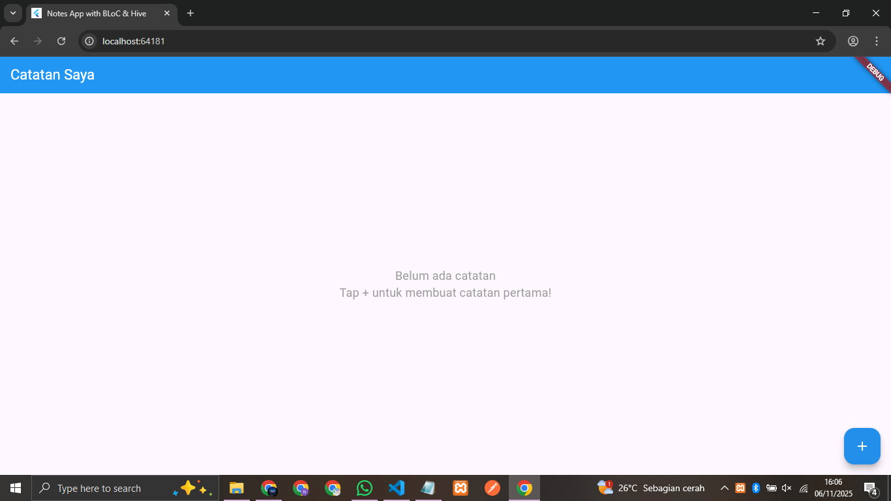
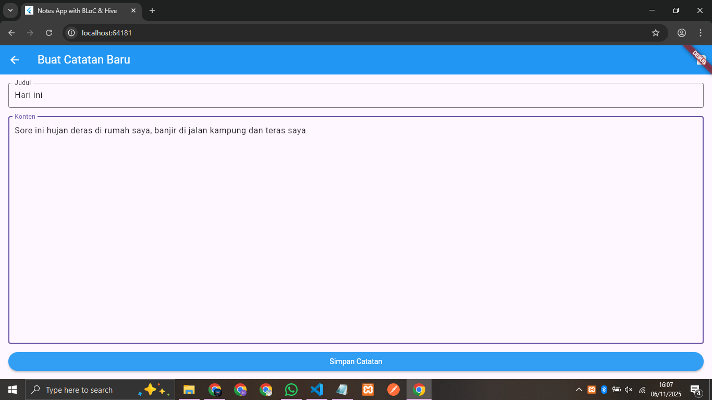

# Flutter Notes App with BLoC & Hive

Aplikasi catatan sederhana yang dibangun dengan Flutter, BLoC state management, dan Hive local database.

## 🚀 Fitur
- ✅ Create, Read, Update, Delete Notes (CRUD)
- ✅ BLoC State Management
- ✅ Hive Local Database
- ✅ Navigation antara screens
- ✅ Responsive UI

## 👥 Anggota Kelompok
- **Bunga Clara October** - UI Layer & Presentasi (NotesListScreen, NoteFormScreen, Navigation)
- **Erinna Dian Kristianti** - Business Logic & Data Layer (Note Model, NotesRepository, Hive, BLoC)

## 🛠️ Teknologi
- Flutter 3.x
- Dart
- BLoC (State Management)
- Hive (Local Database)
- Equatable

## 📸 Screenshots




## 🏃‍♂️ Menjalankan Aplikasi
```bash
flutter pub get
flutter run
```

## 📁 Struktur Project
```lib/
├── main.dart
├── models/
│   └── note.dart
├── repositories/
│   └── notes_repository.dart
├── blocs/
│   ├── notes_list_bloc/
│   └── note_form_cubit/
├── pages/
│   ├── notes_list_screen.dart
│   └── note_form_screen.dart
└── widgets/
```

## 📋 Pembagian Tugas
```
Siswa 1 (Bunga Clara October):

- Membuat halaman UI (NotesListScreen, NoteFormScreen)
- Implementasi navigasi antara halaman
- Integrasi BLoC dengan UI

Siswa 2 (Erinna Dian Kristianti):

- Membuat model data Note
- Implementasi NotesRepository dengan Hive
- Membuat BLoC/Cubit untuk state management
```
=======
# notes-app-bloc-hive
Flutter Notes App with BLoC &amp; Hive - Tugas Pemrograman Perangkat Bergerak
